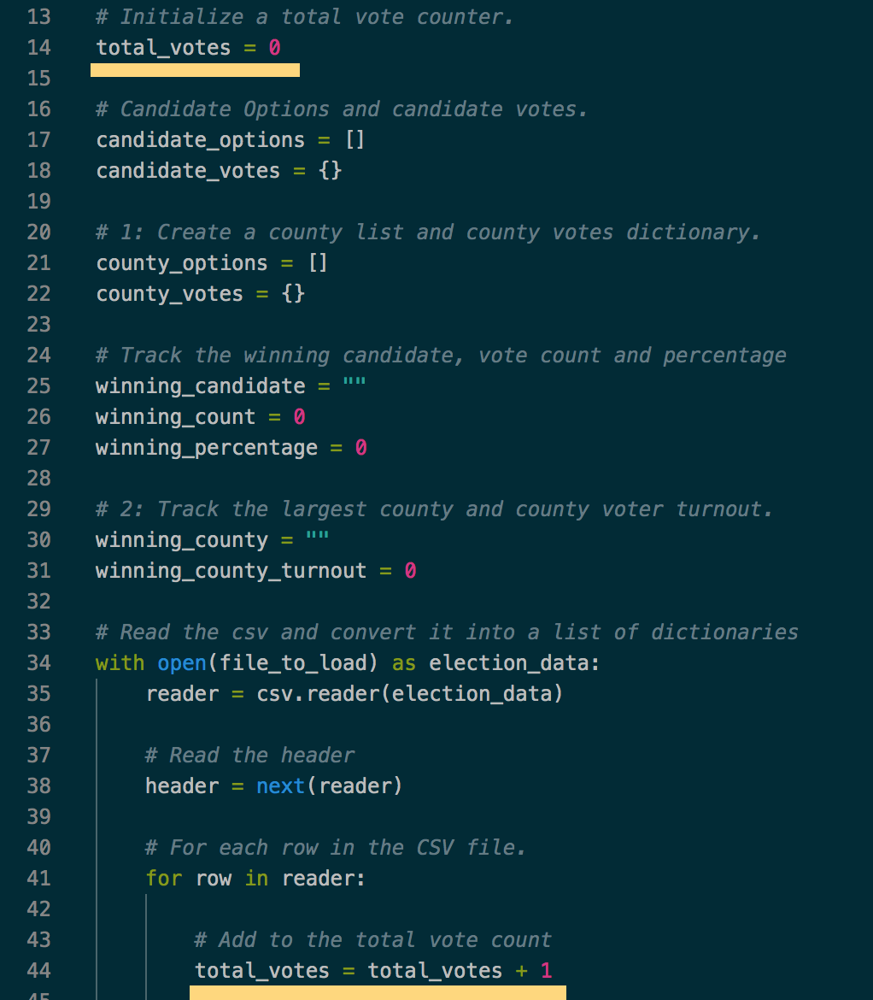
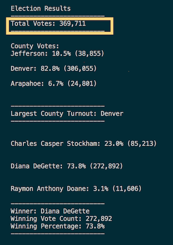
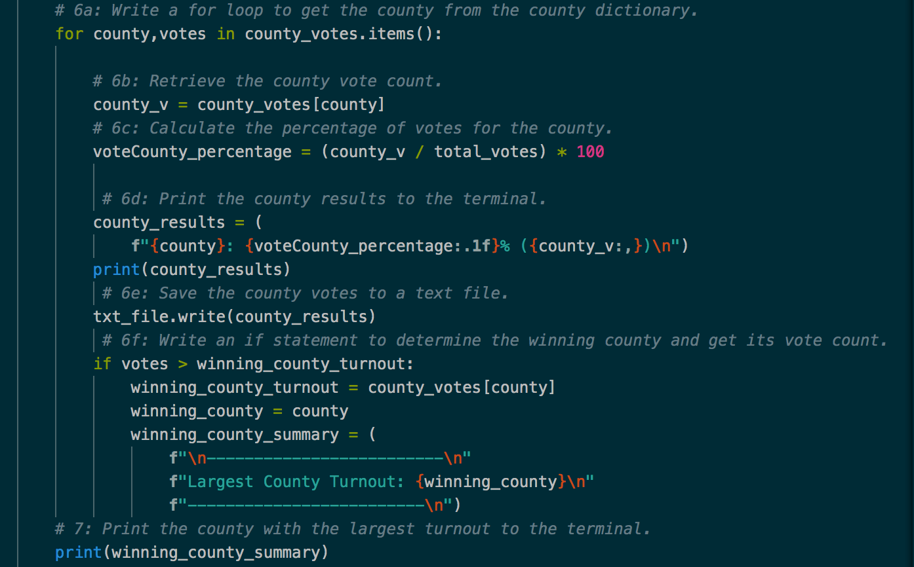
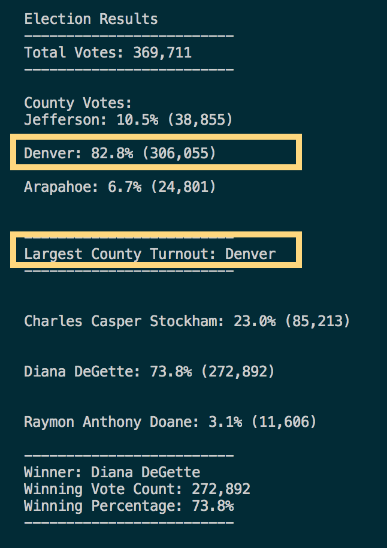

# Election Analysis
## Project Overview
Colorado Board of Elections is in need of auditing for their election results. Data is stored in an excel spreadsheet. Each ballot ID represents a voter's vote, the candidate who receives the most votes wins. The board also wants to know the county that's having the largest turnout.

Python is used to perform analysis on the data file in .csv format. With python programming language, data from the CSV file can be extracted and read through lines of codes and easily compared and summarized. Lists, dictionaries, logical operators, if statement and for loops are some of the pieces that made the analysis using python more productive. And there are dependencies, modules, and packages (such as *csv* and *os* ) that can be used to help the integration between python and other interfaces. Election results is written on a separate text file for audit purposes. Below I will include more details on how the analysis is done.

## Election-Audit Results
Please refer to the bullet points below for a summary of the Colorado election result, with screenshot attached for the corresponding code and results in python print.

 

* There are a total number of **369,711** votes;

> Code below:

 

> Python code run result:

* County Jefferson, Denver, and Arapahoe has 10.5%, 82.8%, and 6.7% of votes respectively, with the number of votes being 38,855, 306,055, and 24,801 accordingly;

* **Denver** has the largest number of votes, being 306,055 in total;

> Code below:

 

> Python code run result:

* Candidate Charles Casper Stockham received 85,213 votes, which takes up 23.0% of the total votes; Diana DeGette had 272,892 votes, with the percentage being 73.8%; and Raymon Anthony Doane received 11,606 votes (3.1%);

* The winning candidate is **Diana Degette**, with 73.8% of the total votes (272,892 votes).

## Election-Audit Summary
The analysis conducted for Colorado Board of Elections can be utilized in other elections with simple modifications of the python code.

Here is a list of items in the python code that can be modified based off any other election data:

1. file_to_load variable to be assigned with a different file for a specific election data.

2. While reading the new data file, check the data file with the column headers, switch off the current python file row 47, 50 with the applicable index numbers used for the lists for each row. *(e.g. row 47 has code candidate_name = row[2] because candidate name was listed in the data file in column C.)*

3. txt_file that's used in the current python code can be modified to write in result for the new election result. New information can be added in accordingly based on the requirement for any eleciton audit.
